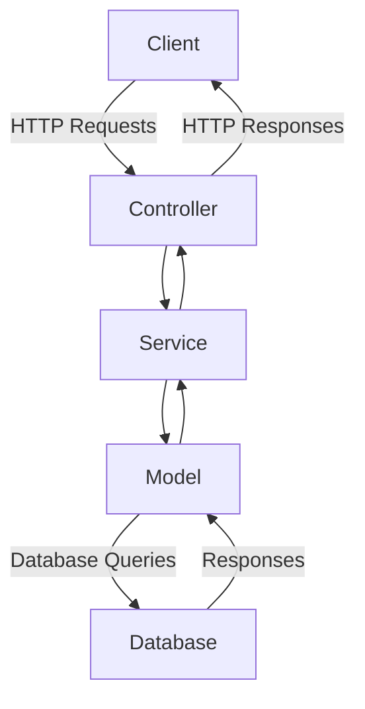
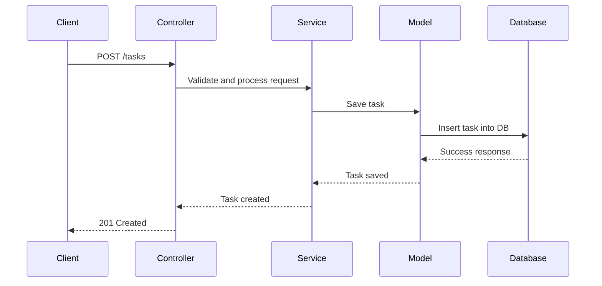

# Sample Node.js Application

This document provides an overview of a sample Node.js application, including its architecture and workflow. The document also includes mermaid diagrams to visualize the application's structure and processes.

## Application Overview

The sample Node.js application is a RESTful API that allows users to manage tasks. It includes the following features:
- User authentication
- CRUD operations for tasks
- Error handling and logging

## Architecture

The application follows a typical MVC (Model-View-Controller) architecture. Below is a mermaid diagram illustrating the architecture:

## Workflow

The workflow for creating a new task is as follows:

1. The client sends a POST request to the API with task details.
2. The controller validates the request and forwards it to the service layer.
3. The service layer interacts with the model to save the task in the database.
4. The database returns a success response to the model.
5. The model passes the response back to the service layer.
6. The service layer sends the response to the controller.
7. The controller sends the final response to the client.

Below is a mermaid sequence diagram for the workflow:

## References

- [Node.js Official Documentation](https://nodejs.org/en/docs/)
- [Express.js Guide](https://expressjs.com/)
- [Mermaid.js Documentation](https://mermaid-js.github.io/mermaid/#/)
- [MVC Design Pattern](https://en.wikipedia.org/wiki/Model%E2%80%93view%E2%80%93controller)
